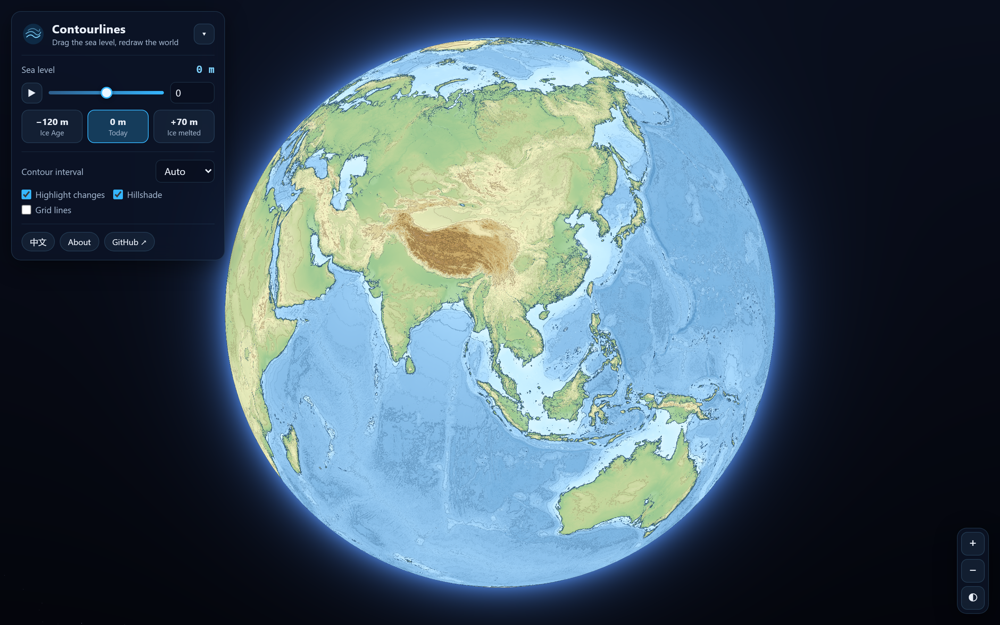
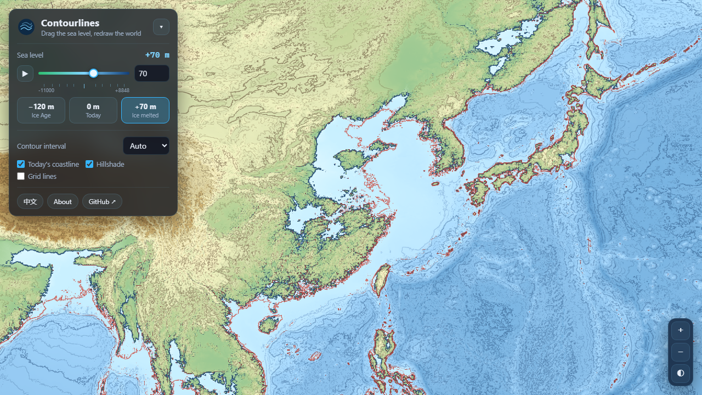
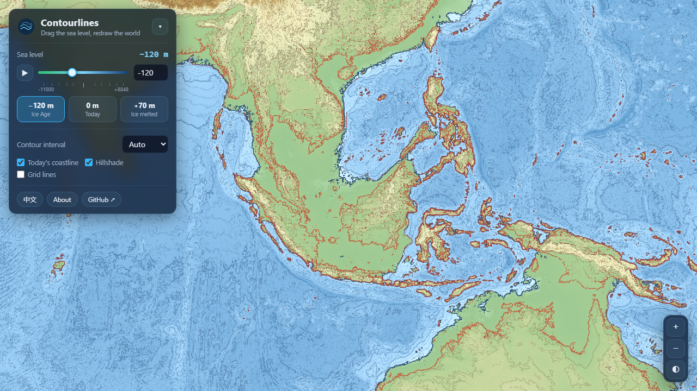
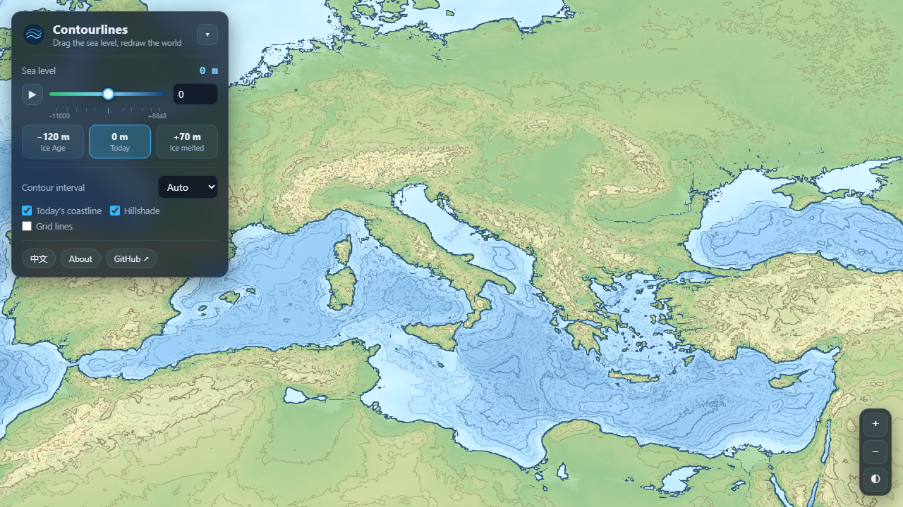
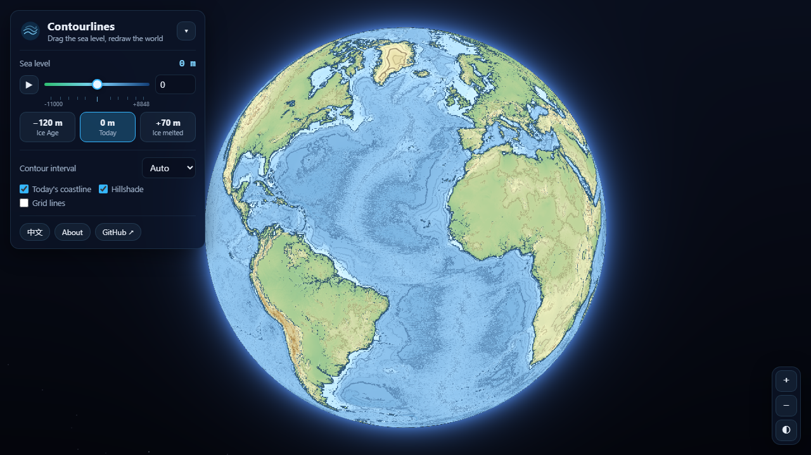

<div align="center">


# Contourlines

**Drag the sea level. Redraw the world.**

An interactive contour map of Earth built from real NOAA elevation & ocean-depth data —
pan it endlessly, zoom out until it becomes a globe, and move the ocean anywhere from
**−11,000 m to +8,848 m** while the coastlines redraw in real time.

[**🌍 Open the live map →**](https://linad3d.github.io/contourlines/)

[](https://linad3d.github.io/contourlines/)
[](LICENSE)


<a href="https://linad3d.github.io/contourlines/">

</a>

</div>

---

## What is this?

**Contourlines** renders the whole planet — land *and* ocean floor — as a classic
topographic contour map: isolines, hypsometric tints, hillshading, coastlines. Underneath
is a real elevation model (NOAA ETOPO1), so it doubles as a **sea level rise simulator**:

- 🌊 **Drag the sea level slider** and watch coasts flood or drain instantly. The scale is
  exponential and spans the entire planet: from a bone-dry Mariana Trench (−11,000 m) to a
  submerged Mount Everest (+8,848 m) — fine, meter-level control near today's coastline,
  accelerating as you pull toward the extremes.
- 🔁 **Seamless infinite panning** — the map wraps east–west with no seams, like spinning
  a paper map into a cylinder.
- 🌐 **Flat map ⇆ globe morph** — zoom all the way out and the map rolls itself onto an
  orthographic globe, with an atmosphere glow and stars.
- 📍 **Unified relative mapping + reference coastline** — every color and contour is
  computed from the *current* waterline (drained seafloor turns green → yellow → brown as
  it climbs; flooded land becomes genuine shallow sea), while a crimson line keeps marking
  today's 0 m coastline so the swallowed or reclaimed band is obvious at a glance.
- 📏 **Live elevation readout** — hover anywhere to see latitude, longitude, elevation,
  and how far under the new sea surface it is.
- 🔗 **Shareable URLs** — the view, sea level, and options are encoded in the address bar.
- 🇬🇧🇨🇳 **Bilingual UI** — English and 中文.

Everything runs in your browser with **WebGL2, zero dependencies, no build step, no
server, no tracking** — the entire app is one HTML file, one stylesheet, one script, and
two PNG heightmaps.

## Screenshots

| Sea level +70 m — the ice has melted | Sea level −120 m — the last Ice Age |
| :--: | :--: |
|  |  |

| Contour detail with hillshading | Zoomed out to the globe |
| :--: | :--: |
|  |  |

## Try these

| Scenario | Link |
| --- | --- |
| 🫠 **All ice melted** (+70 m) — East China floods | [open](https://linad3d.github.io/contourlines/?sea=70&lon=118&lat=32&z=18) |
| 🧊 **Last Glacial Maximum** (−120 m) — walk from Thailand to Borneo | [open](https://linad3d.github.io/contourlines/?sea=-120&lon=110&lat=3&z=14) |
| 🌉 **Doggerland** (−60 m) — when Britain wasn't an island | [open](https://linad3d.github.io/contourlines/?sea=-60&lon=2&lat=54&z=28) |
| 🏜️ **Drain the Mediterranean** (−2500 m) | [open](https://linad3d.github.io/contourlines/?sea=-2500&lon=15&lat=38&z=16) |
| 🗻 **Himalaya contours** at 0 m | [open](https://linad3d.github.io/contourlines/?lon=86.9&lat=28&z=40) |

## How it works

```
NOAA ERDDAP (ETOPO1, 1 arc-min)
        │  strided subset → 5 arc-min grid (4320 × 2160)
        ▼
tools/fetch-data.mjs        hand-rolled NetCDF-3 parser + PNG encoder (Node, no deps)
        │  elevation + 11000 → 16-bit value packed into R/G channels
        ▼
data/elev-4320.png          lossless heightmap, ~9 km per texel
        │  decoded byte-exact via createImageBitmap
        ▼
WebGL2 fragment shader      manual bilinear sampling → elevation field
                            • hypsometric tint relative to current sea level
                            • fwidth() anti-aliased contour lines & coastline
                            • screen-space hillshading
                            • today's-coastline reference line
WebGL2 vertex shader        lon/lat grid projected as equirectangular map or
                            orthographic globe — blended for the zoom-out morph
```

There is no tile server and no map library: the planet is a single texture, and every
visual — contours, coastline, shading, flooding — is computed per-pixel, per-frame in
the fragment shader. That's why the sea level slider feels instant: changing it is just
one shader uniform.

### The globe morph

The flat map is an equirectangular projection; the globe is orthographic with radius
`R = scale · 180/π`, chosen so the sphere's circumference equals the flat map's width.
The vertex shader linearly blends each vertex between its two projected positions, so
zooming out literally rolls the map onto the sphere — and because drag sensitivity is
identical in both projections, panning feels continuous through the transition.

## Run it locally

```bash
git clone https://github.com/linad3d/contourlines.git
cd contourlines
python -m http.server 8000     # or any static file server
# open http://localhost:8000
```

### Rebuild the elevation data from source

```bash
node tools/fetch-data.mjs
```

Downloads a fresh ETOPO1 subset from NOAA ERDDAP, parses the NetCDF, verifies known
elevations (Everest, the Mariana Trench), and re-encodes both PNG heightmaps.
Node ≥ 18, no npm packages required.

## Accuracy, honestly

This is a **static "bathtub" model at ~9 km resolution**, built for intuition and
education. It ignores tides, storm surge, glacial isostatic adjustment, groundwater,
levees, and erosion — so it will happily flood the Netherlands, which in reality has
opinions about that. Don't use it for engineering, insurance, or evacuation planning.

## 中文简介

**Contourlines** 是一个交互式世界等高线地图和海平面模拟器：

- 基于 NOAA ETOPO1 真实高程与海底地形数据（约 9 公里分辨率）；
- 地图东西方向无缝循环拖拽，缩到最小时变成三维地球；
- 指数刻度滑杆覆盖整个星球：从排干的马里亚纳海沟（−11000 米）到被淹没的珠穆朗玛峰
  （+8848 米），近海岸精细到米、越往两端变化越快，海岸线实时重绘；
- 预设场景：−120 米（末次冰盛期，白令陆桥、巽他陆架浮现）、+70 米（冰盖全部融化）；
- 全部配色与等高线以当前水面为零点统一重算：排干的海床会依相对高度呈现绿→黄→棕的
  完整分层设色，被淹没的陆地则成为真正的浅海；红色参考线始终标注今日海岸线原位置；
- 悬停可读取任意位置的海拔，以及相对当前海面的高度或深度；
- 纯前端 WebGL2 实现，零依赖、无构建、无服务器、无跟踪，界面支持中英文切换。

在线体验：**<https://linad3d.github.io/contourlines/>**

## Data & credits

Elevation and bathymetry: [NOAA ETOPO1 Global Relief Model](https://www.ncei.noaa.gov/products/etopo-global-relief-model)
(public domain) — Amante, C. and B.W. Eakins, *ETOPO1 1 Arc-Minute Global Relief Model*,
NOAA NGDC, 2009. [doi:10.7289/V5C8276M](https://doi.org/10.7289/V5C8276M).
Land palette inspired by classic Wikipedia topographic map conventions.

## License

[MIT](LICENSE) — do anything, just keep the notice. If you build something fun with it,
open an issue and show it off.
